# Диаграммы (блок 1 ТЗ)

Исходный формат — [Mermaid](https://mermaid.js.org/). Рендер: GitHub, VS Code (расширение Mermaid), Typora и др.

---

## 1. Activity — основной сценарий «клиент: запись на услугу»

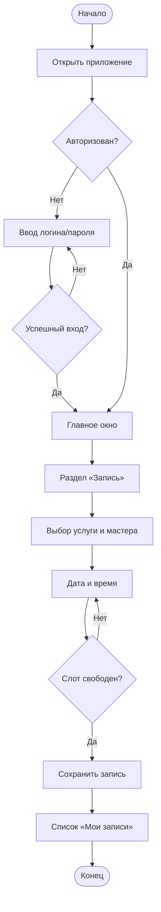

---

## 2. Use Case

Акторы снаружи, внутри рамки **ИС Матье** — прецеденты. Стиль как у Activity: сначала объявления узлов, затем связи. Вставка: [mermaid.live](https://mermaid.live) или draw.io → **Insert → Mermaid**.

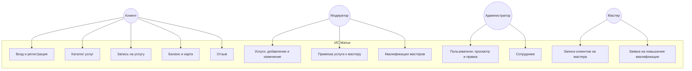

Тот же смысл, **латиница** (если рендер ругается на кириллицу):

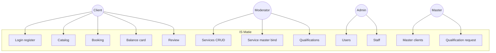

---

## 3. ER-диаграмма (основные сущности)

Стиль как у Activity / Use Case: сначала узлы сущностей, затем связи (направление: от зависимой строки к справочнику / «родителю»). Вставка: [mermaid.live](https://mermaid.live) или draw.io → **Insert → Mermaid**.

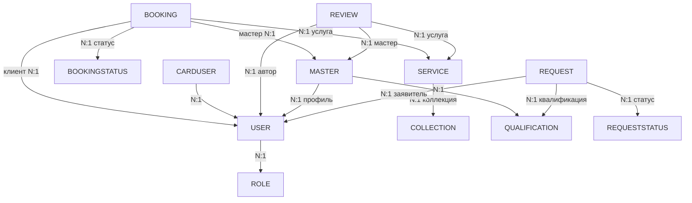

Тот же смысл, **латиница**:

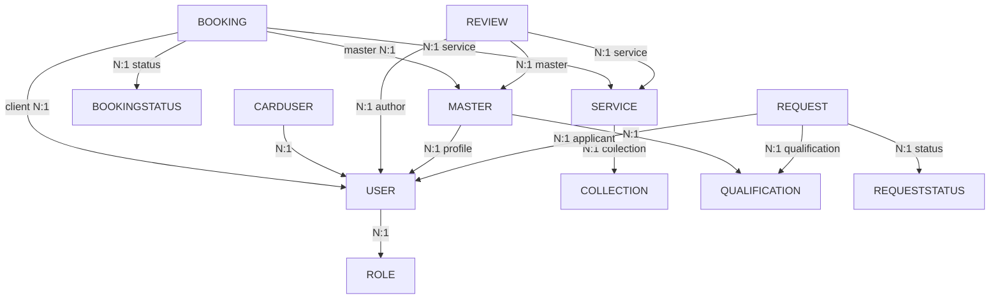

**Альтернатива** — встроенная нотация Mermaid `erDiagram` (кардинальность `||--o{` и т.д.):

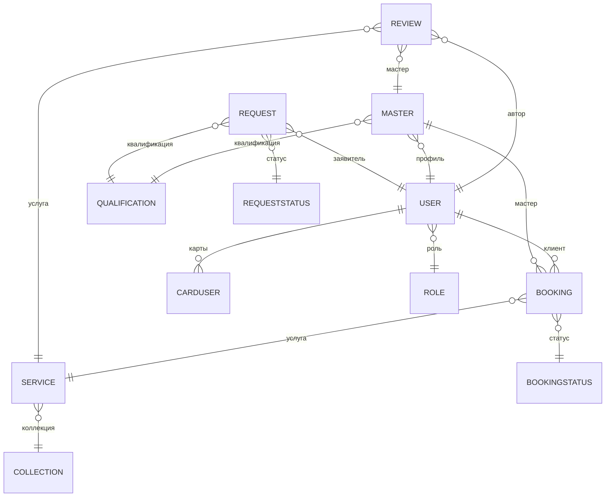

---

## 4. DFD (уровень 0 и фрагмент уровня 1)

Стиль как у Use Case: `flowchart TD`, сначала узлы, затем связи. Вставка: [mermaid.live](https://mermaid.live) или draw.io → **Insert → Mermaid**.

**DFD уровень 0 (контекст):**

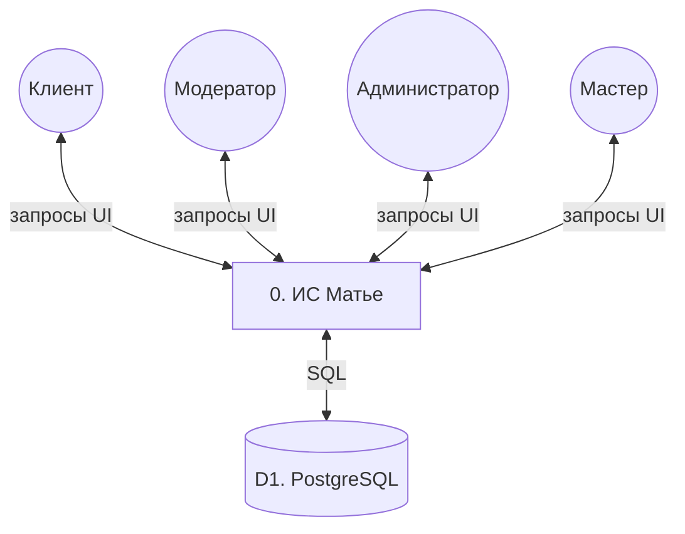

**DFD уровень 0, латиница:**

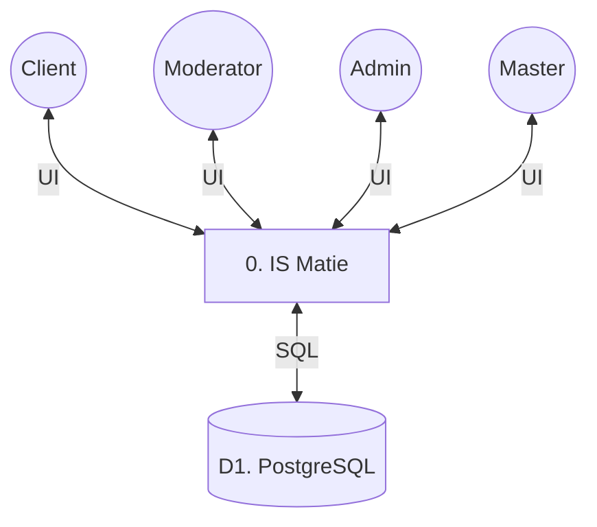

**Фрагмент DFD уровня 1 (процессы и хранилище):**

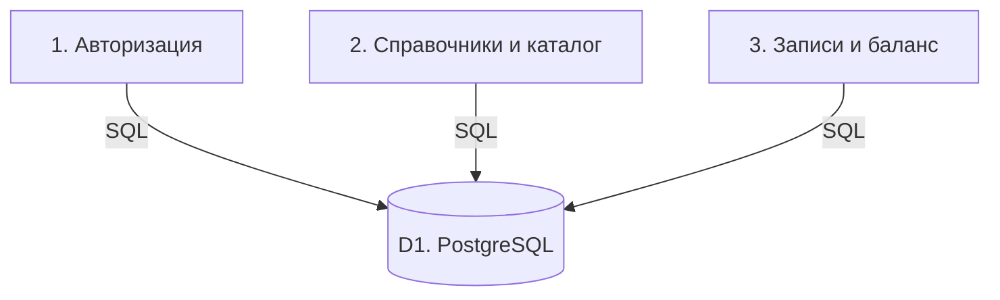

**Тот же фрагмент, латиница:**

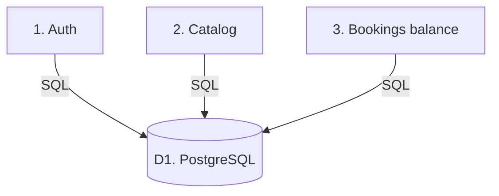

---

## 5. Диаграмма классов

Полная UML-структура в нотации Mermaid `classDiagram`: **имена классов по-русски**, поля и методы — **на английском** (как в учебном примере). Обобщение ролей (`<|--`) — логическая модель; в БД все роли хранятся в одной таблице `User` с полем `roleId`. Агрегация — `o--` (ромб у владельца). Вставка: [mermaid.live](https://mermaid.live) или draw.io → **Insert → Mermaid**.

### 5.1. Роли пользователей и связи с сущностями предметной области

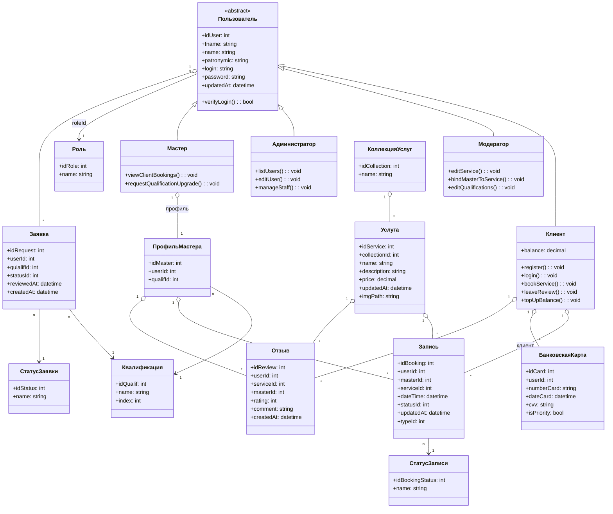

### 5.2. Доступ к данным, утилита и окно приложения

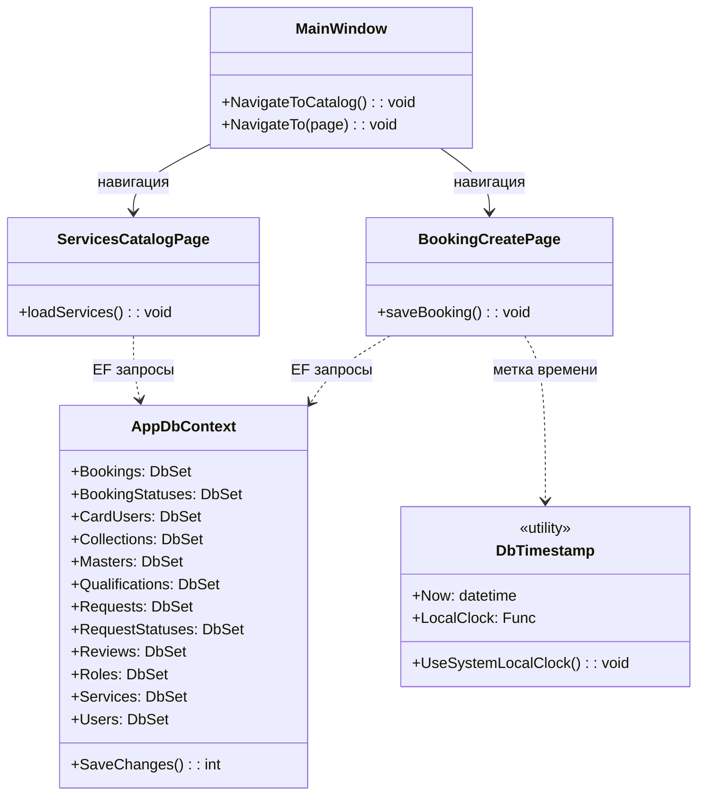

*Примечание: для защиты экспортируйте PNG из Mermaid или перерисуйте в Visio / Draw.io. Если draw.io «режет» большую `classDiagram`, вставляйте блоки 5.1 и 5.2 по отдельности.*
