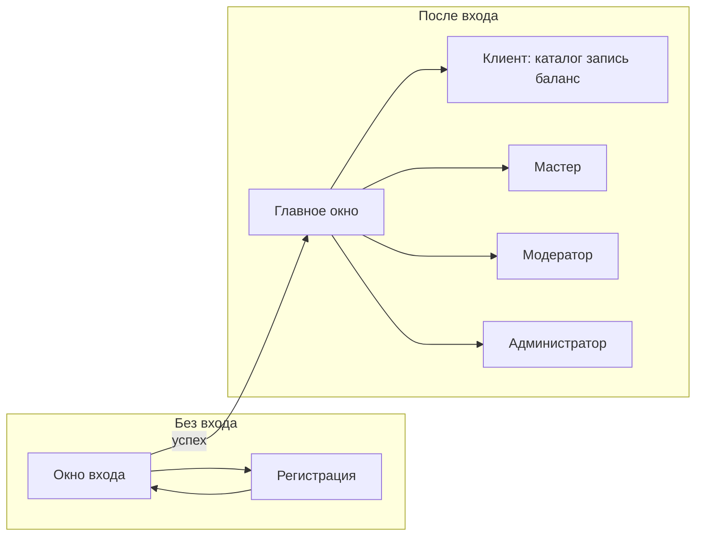

# Обучающая документация: руководство пользователя и спецификация приложения

**Информационная система:** Лавка «Матье» (клиентское десктоп-приложение).

**Версия документа:** 1.0  
**Дата:** апрель 2026 г.

---

# Часть I. Руководство пользователя

## I.1. Назначение и общие сведения

«Лавка „Матье“» — клиентское приложение для **Windows** (десктоп на .NET 8 и Avalonia): просмотр каталога услуг, запись к мастерам, баланс и отзывы (**роль клиента салона**); панель мастера (записи клиентов, заявка на квалификацию); модерация каталога и привязок (**модератор**); управление пользователями и сотрудниками (**администратор**).

Данные хранятся в **PostgreSQL**. Для работы должен быть доступен сервер БД; строка подключения задаётся в коде (`AppDbContext.OnConfiguring`) и продублирована в **`appsettings.json`** в каталоге с приложением — при развёртывании проверьте хост, порт, имя базы и учётные данные.

Первый экран после запуска — **окно входа** (`AuthPage`). После успешной авторизации открывается **главное окно** с каталогом услуг и боковым меню.

---

## I.2. Содержание по функциям

| № | Раздел руководства | Кратко |
|---|-------------------|--------|
| I.2.1 | [Запуск и экран входа](#i21-запуск-и-экран-входа) | Первый запуск, логин и пароль, регистрация |
| I.2.2 | [До входа в систему](#i22-до-входа-в-систему) | Только вход или регистрация; каталог в главном окне — после входа |
| I.2.3 | [Функции клиента салона](#i23-функции-клиента-салона) | Каталог, запись, баланс, карты, отзывы, «Мои записи» |
| I.2.4 | [Функции мастера](#i24-функции-мастера) | Клиенты (записи), заявка на квалификацию |
| I.2.5 | [Функции модератора](#i25-функции-модератора) | Список и форма услуг, привязки, квалификации |
| I.2.6 | [Функции администратора](#i26-функции-администратора) | Пользователи, правка пользователя, сотрудники |
| I.2.7 | [Выход и закрытие приложения](#i27-выход-и-закрытие-приложения) | Выход из сессии, подтверждение закрытия окна |

### I.2.1. Запуск и экран входа

1. Запустите исполняемый файл сборки (например `MatieAvalonia.exe` в папке `publish` или `bin\…\net8.0\`).
2. Убедитесь, что **PostgreSQL** запущен и параметры подключения верны; при ошибке подключения к БД операции сохранения и загрузки списков могут завершаться сообщениями об ошибке в интерфейсе.
3. На экране входа введите **логин** и **пароль** учётной записи.
4. Кнопка **«Перейти к регистрации»** открывает форму создания нового пользователя с ролью клиента салона (поля ФИО, логин, пароль).

**Индикация:** в шапке окна входа отображается название «Матье»; при ошибке входа показывается красный текст под полями. После входа в главном окне в шапке отображаются **ФИО и название роли** (см. раздел I.3).

### I.2.2. До входа в систему

Пока пользователь не авторизован, отдельное окно входа не даёт доступа к главному окну. После успешного входа открывается главное окно с каталогом.

### I.2.3. Функции клиента салона

| Функция | Действия пользователя |
|--------|------------------------|
| **Каталог услуг** | Вкладки **«Кастом»** и **«Косплей»** переключают линейку коллекций; справа — **поиск** и выбор **коллекции**; карточки услуг с ценой и строкой «Обновлено»; кнопки **А→Я** / **Я→А** для сортировки; пагинация внизу и кнопки **◀** / **▶** в правой панели. |
| **Коллекции** | Пункт меню «Коллекции» — список коллекций; двойной щелчок открывает каталог с фильтром по коллекции. |
| **Запись на услугу** | Меню «Запись»: выбор услуги, мастера, даты и времени (**ЧЧ:ММ**); проверка занятости слота; при сохранении — переход к **«Мои записи»**; номер очереди на день отображается в списке (поле очереди). Списание с баланса при записи **не реализовано** — запись создаётся с учётом статусов из БД. |
| **Баланс** | Меню «Баланс» — отображение баланса. |
| **Пополнение** | Меню «Пополнить»: новая карта (номер, срок, CVV) или выбор сохранённой карты и сумма; учебная модель без реального платёжного шлюза. |
| **Мои записи** | Список записей: услуга, мастер, дата/время, статус (как в БД), очередь, обновлено; пагинация и сортировка по названию услуги. |
| **Отзыв** | Меню «Отзыв»: выбор услуги, оценка, комментарий; сохранение в БД. |

### I.2.4. Функции мастера

- Пункт **«Клиенты»** — таблица записей клиентов к этому мастеру (двойной щелчок по строке может открыть карточку услуги).
- Пункт **«Заявка на квал.»** — подача заявки на повышение квалификации; отображаются даты и статус заявки (по данным БД).

### I.2.5. Функции модератора

- **Список услуг** — таблица услуг с сортировкой и страницами; переход к форме услуги.
- **Форма услуги** — создание и редактирование (название, описание, цена, коллекция, изображение); поле **«Обновлено»** показывает дату последнего сохранения.
- **Привязки** — привязка услуг к мастерам.
- **Квалификации** — работа со справочником квалификаций мастеров.

### I.2.6. Функции администратора

- **Пользователи** — список пользователей; двойной щелчок — переход к правке.
- **Правка пользователя** — изменение данных, отображение «Обновлено».
- **Сотрудники** — учёт сотрудников и мастеров (по логике экрана).

### I.2.7. Выход и закрытие приложения

- Кнопка **«Выход»** внизу бокового меню завершает сессию и возвращает на экран входа.
- Закрытие главного окна крестиком в шапке открывает диалог с текстом вроде **«Закрыть окно „Матье“?»** — **Да** / **Нет**.

---

## I.3. Содержание по индикации процесса

Ниже — как приложение сообщает о ходе операций: элементы интерфейса, подсказки и сообщения.

### I.3.1. Оглавление по типам индикации

| № | Тема | Подраздел |
|---|------|-----------|
| I.3.2 | [Шапка главного окна](#i32-шапка-главного-окна) | ФИО и роль |
| I.3.3 | [Ошибки у форм](#i33-ошибки-у-форм) | Красный текст, валидация |
| I.3.4 | [Подтверждение закрытия](#i34-подтверждение-закрытия) | Диалог выхода |
| I.3.5 | [Подсказки внизу окна](#i35-подсказки-внизу-окна) | Строка состояния для текущей страницы |
| I.3.6 | [Списки и статусы](#i36-списки-и-статусы) | Пагинация, статусы записей из БД |

### I.3.2. Шапка главного окна

- После входа: строка вида **«ФИО · название роли»** (данные из сессии и таблицы ролей).
- Логотип и название **«Матье»** в левой части шапки.

### I.3.3. Ошибки у форм

| Ситуация | Пример текста |
|----------|----------------|
| Ошибка входа | Сообщение под полями логина/пароля |
| Запись | «Выберите услугу.», «Выберите мастера.», «Введите время в формате ЧЧ:ММ», «Это время у выбранного мастера уже занято…», «Выберите дату и время в будущем.» |
| Загрузка списков | «Не удалось загрузить списки.» |
| Карты / баланс | Сообщения об ошибке формата суммы, карты и т.д. (красный текст под формой) |
| Модератор / админ | «Ошибка при загрузке услуги/пользователя» и др. |

### I.3.4. Подтверждение закрытия

- Окно **«Выход»**, вопрос о закрытии, кнопки **Да** / **Нет** (текст сообщения задаётся из главного окна).

### I.3.5. Подсказки внизу окна

В нижней строке главного окна для разных экранов выводятся подсказки, например:

- каталог — сводка пагинации («1–3 из N»);
- коллекции — «двойной щелчок — услуги этой коллекции»;
- мои записи — «двойной щелчок — карточка услуги; „Повторить“ — новая запись»;
- и т.д. по текущей странице.

### I.3.6. Списки и статусы

- **Пагинация:** в каталоге и таблицах — диапазон записей и переключение страниц.
- **Статусы записей:** в списке «Мои записи» отображается **имя статуса из базы данных** (колонка статуса услуги бронирования), а не фиксированный английский перечислитель.
- **Очередь:** числовой номер в день (поле очереди в таблице).

---

## I.4. Графические иллюстрации приложения

### I.4.1. Рекомендуемые скриншоты

Сохраните снимки экрана в каталог **`MatieAvalonia/Docs/user-manual/images/`** (создайте папку при необходимости). Имена файлов можно менять при вставке в отчёт.

| Файл (пример) | Содержание кадра |
|---------------|------------------|
| `01-login.png` | Окно входа с полями логина и пароля |
| `02-register.png` | Форма регистрации |
| `03-catalog.png` | Главное окно: вкладки Кастом/Косплей, каталог, правая панель поиска |
| `04-booking.png` | Форма записи: услуга, мастер, дата и время |
| `05-balance-cards.png` | Баланс и/или пополнение карты |
| `06-my-bookings.png` | Список «Мои записи» |
| `07-master.png` | Экран мастера: клиенты или заявка |
| `08-moderator-service.png` | Форма услуги модератора |
| `09-admin-users.png` | Список пользователей |
| `10-exit-confirm.png` | Диалог подтверждения закрытия окна |

### I.4.2. Схема переходов между основными экранами

### I.4.3. Структура главного окна (логическая)

**Верх:** шапка с названием «Матье», строкой сессии (ФИО · роль), кнопки свернуть и закрыть.  
**Слева:** боковое меню — коллекции, блок «Клиенту», блок «По роли» (модератор / администратор / мастер), кнопки «Услуги», «Выход».  
**Центр:** вкладки **Кастом** / **Косплей** и область текущей страницы.  
**Справа** (на экране каталога): поиск, фильтр коллекции, кнопки страниц каталога.  
**Низ:** строка подсказки для активной страницы.

**Дополнительно:** диаграммы Activity, Use Case, ER, DFD и классов — в **`Docs/DIAGRAMS.md`** (экспорт в PNG из [mermaid.live](https://mermaid.live)).

---

## I.5. Техническая поддержка и ограничения (для пользователя)

- Изображения услуг подгружаются из **`Resources/`** рядом с исполняемым файлом и из встроенных ресурсов; пути в БД должны быть согласованы с файлами (см. скрипты в `Docs/`).
- Пополнение баланса — **учебная модель**, без подключения к банку или платёжному шлюзу.
- Строка подключения к PostgreSQL: **`AppDbContext`** и файл **`appsettings.json`** — при смене сервера отредактируйте оба места или доработайте загрузку конфигурации в коде.

---

## Приложение к части I. Справочник: функции и экраны (код)

| № | Функция | Экран / раздел | Описание |
|---|---------|----------------|----------|
| 1 | Вход в систему | `AuthPage` | Ввод логина и пароля; переход к регистрации; после успешного входа — главное окно. |
| 2 | Регистрация клиента | `RegisterPage` | Создание учётной записи с ФИО, логином и паролем (роль клиента). |
| 3 | Главное окно и навигация | `MainWindow` | Боковое меню: услуги, коллекции, разделы для клиента, модератора, администратора, мастера; шапка с ФИО; выход. |
| 4 | Каталог услуг | `ServicesCatalogPage` | Список услуг с пагинацией, сортировкой по названию, поиском, фильтром по коллекции; на карточке — цена, дата обновления. |
| 5 | Коллекции | `CollectionsPage` | Просмотр коллекций услуг. |
| 6 | Карточка услуги | `ServiceDetailPage` | Подробности услуги, дата обновления. |
| 7 | Запись на услугу | `BookingCreatePage` | Выбор услуги, мастера, даты и времени; проверка занятости слота; очередь на день. |
| 8 | Мои записи | `MyBookingsPage` | Список записей клиента с сортировкой и страницами. |
| 9 | Баланс | `UserBalancePage` | Отображение баланса пользователя. |
| 10 | Пополнение баланса | `CardTopUpPage` | Ввод или выбор карты, сумма пополнения. |
| 11 | Отзыв | `ReviewCreatePage` | Выбор услуги, оценка, текст отзыва. |
| 12 | Список услуг (модератор) | `ModeratorServicesPage` | Таблица услуг с сортировкой и пагинацией. |
| 13 | Форма услуги (модератор) | `ModeratorServiceFormPage` | Создание и редактирование услуги, изображение, поле «Обновлено». |
| 14 | Привязки мастеров к услугам | `ModeratorMasterServiceBindingsPage` | Настройка связей мастер — услуга. |
| 15 | Квалификации мастеров | `ModeratorMasterQualificationPage` | Работа со справочником квалификаций. |
| 16 | Пользователи (администратор) | `AdminUsersListPage` | Список пользователей. |
| 17 | Правка пользователя | `AdminUserEditPage` | Изменение данных пользователя, отображение «Обновлено». |
| 18 | Сотрудники | `AdminStaffPage` | Учёт сотрудников. |
| 19 | Клиенты мастера | `MasterClientsPage` | Записи клиентов к данному мастеру. |
| 20 | Заявка на квалификацию | `MasterQualificationRequestPage` | Подача заявки мастером на повышение квалификации. |

*Доступ к пунктам 12–15 зависит от роли «Модератор», к 16–18 — «Администратор», к 19–20 — «Мастер»; пункты 4–11 ориентированы на клиента.*

---

# Часть II. Спецификация приложения

## II.1. Информация о разработчике

| Поле | Значение |
|------|----------|
| Наименование работы | Курсовой / учебный проект: информационная система «Лавка „Матье“» |
| Тема | Клиентское приложение учёта услуг, записей и ролей персонала салона |
| Разработчик | *Указать ФИО, группу, учебное заведение при сдаче* |
| Репозиторий / носитель | *По требованию преподавателя* |

---

## II.2. Информация о сервере базы данных

| Параметр | Значение |
|----------|----------|
| СУБД | **PostgreSQL** |
| Драйвер доступа из приложения | **Npgsql** через пакет `Npgsql.EntityFrameworkCore.PostgreSQL` |
| Строка подключения (как в текущей версии кода) | Хост `localhost`, порт **5555**, пользователь `postgres`, база **`MatieDB`** (задаётся в `MatieAvalonia/Data/AppDbContext.cs`, метод `OnConfiguring`) |
| Примечание | Для сдачи и продакшена рекомендуется вынести параметры в `appsettings.json` и не хранить пароль в исходном коде. |

---

## II.3. Информация о базе данных

| Параметр | Значение |
|----------|----------|
| Имя базы данных | **MatieDB** (в строке подключения) |
| Схема | По умолчанию `public` |
| Основные таблицы | `User`, `Role`, `Services`, `Collection`, `Booking`, `BookingStatus`, `Master`, `Qualification`, `CardUser`, `Reviews`, `Request`, `RequestStatuses` и др. (точные имена с учётом регистра — в схеме БД и в `AppDbContext`) |
| Логическая модель | Сущности пользователей, услуг, коллекций, записей, мастеров, квалификаций, карт, отзывов, заявок — см. ER-диаграмму в **`Docs/DIAGRAMS.md`** |
| Демо-данные SQL | **`Docs/seed_demo.sql`** (коллекции и пример услуги) |
| Описание структуры в формате DBML | **`Docs/MatieDB.dbml`** (для dbdiagram.io) |

---

## II.4. Информация о платформе, для которой разработано приложение

| Параметр | Значение |
|----------|----------|
| Язык и среда | **C#**, **.NET 8** (`TargetFramework`: `net8.0`) |
| Тип приложения | Десктоп, исполняемый файл Windows (`OutputType`: `WinExe`) |
| UI | **Avalonia UI 11.3.5** (Fluent, шрифты Inter, DataGrid) |
| ОС | Целевая: **Windows 10/11**; при наличии .NET 8 возможен запуск на других платформах с поддержкой Avalonia |
| Доступ к данным | **Entity Framework Core 8.0.26**, сопоставление таблиц — Fluent API в `AppDbContext` |

---

## II.5. Информация о программе

| Параметр | Значение |
|----------|----------|
| Назначение | Учёт услуг салона, записей клиентов, ролей (клиент, модератор, администратор, мастер), отзывов, баланса и банковских карт (учебная модель), заявок на квалификацию |
| Имя окна | «Лавка „Матье“» |
| Запуск из исходников | `dotnet run --project MatieAvalonia/MatieAvalonia.csproj` |
| Сборка | `dotnet build MatieAvalonia.sln` |
| Публикация | `dotnet publish` (профиль по необходимости) |
| Ключевые модули | Авторизация и регистрация; каталог и коллекции; запись и расписание; личный кабинет клиента; панели модератора, администратора и мастера |
| Метки времени изменения | Единая логика `MatieAvalonia.Classes.DbTimestamp` для полей `UpdatedAt` / `Updated_At` и совместимости с типом `timestamp without time zone` в PostgreSQL |

---

## II.6. Информация о результате тестирования

### Автоматическое тестирование

| Показатель | Значение |
|------------|----------|
| Проект тестов | `MatieAvalonia.Tests` |
| Команда запуска | `dotnet test MatieAvalonia.sln` |
| Покрытие | **11** тестов: **5** — класс `DbTimestamp` (метка времени для БД); **6** — правила расписания записей `BookingScheduleRules` |
| Статус (последняя проверка в разработке) | Все тесты пройдены |

Подробное описание имён тестов `DbTimestamp` и ручных сценариев — в **`Docs/TEST_CASES.md`**.

### Ручное тестирование

Пять тест-кейсов (по одному на ключевую функцию): авторизация, каталог, запись, пополнение баланса, сохранение услуги модератором. Таблица с шагами, ожидаемым и фактическим результатом — в **`Docs/TEST_CASES.md`**, раздел 2.

---

*Конец документа. При обновлении версий пакетов или строки подключения скорректируйте разделы II.2–II.4.*
